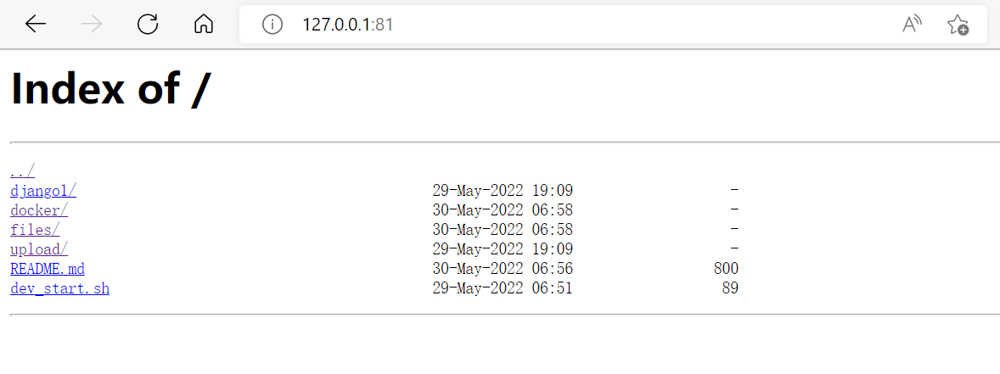
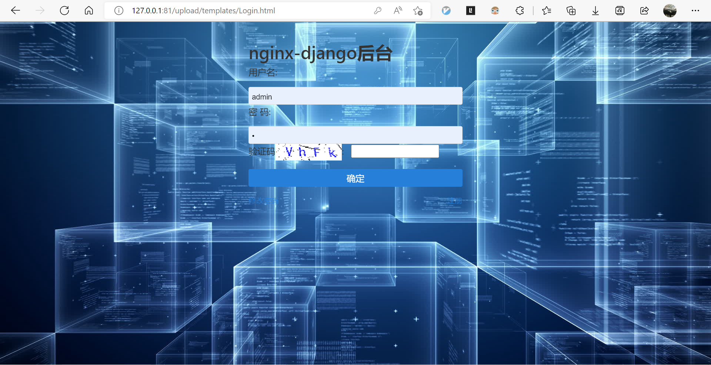
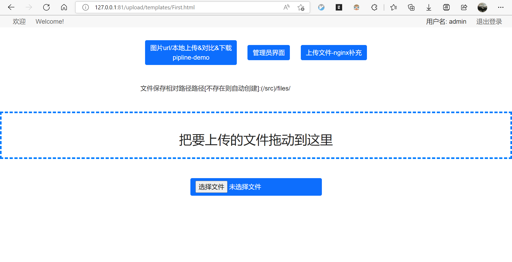
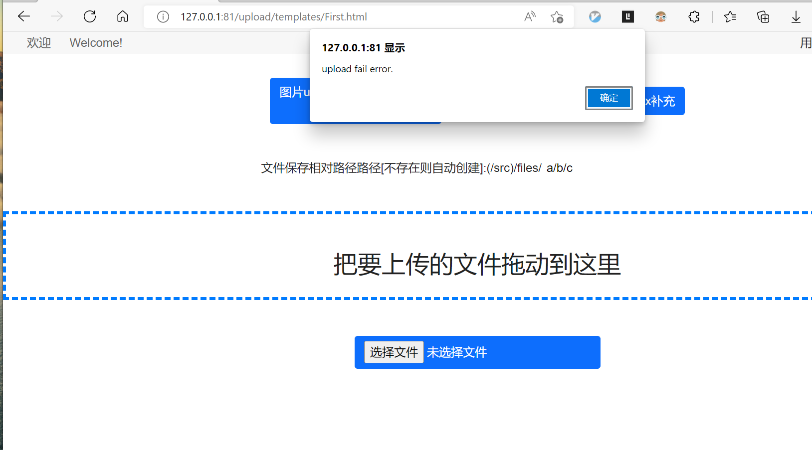
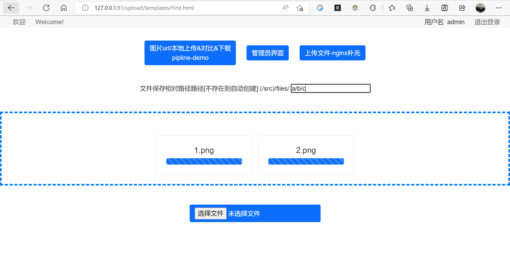
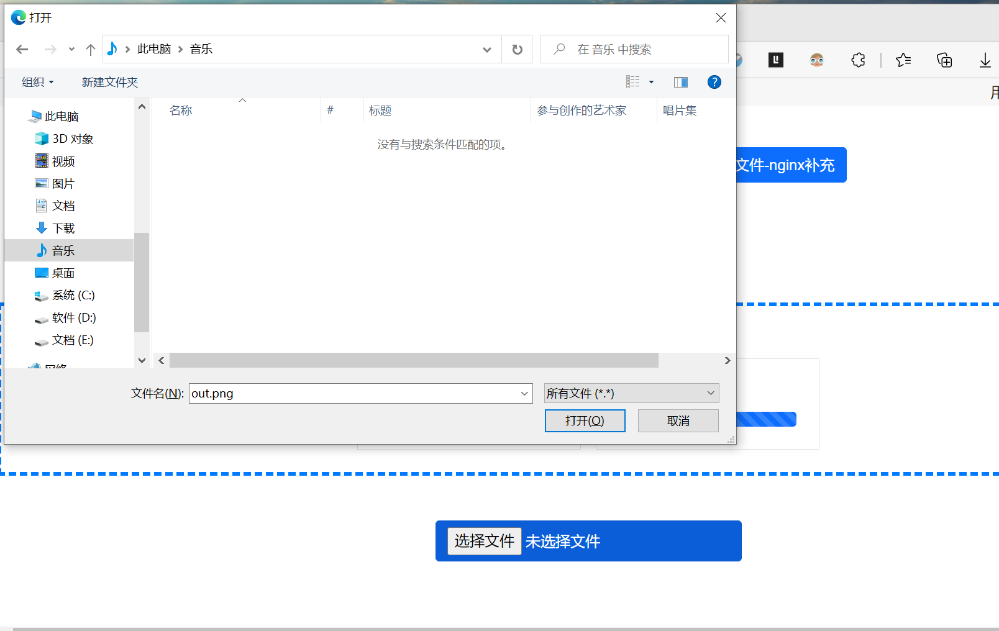
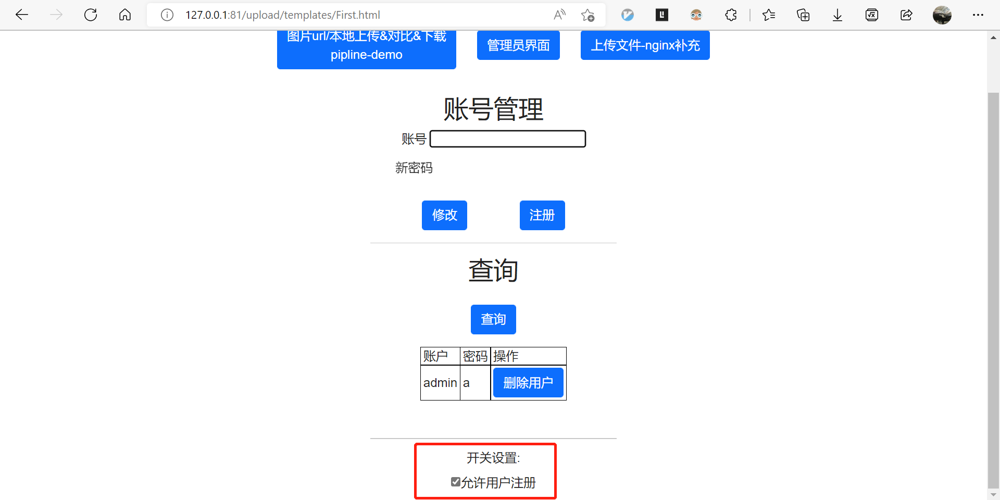
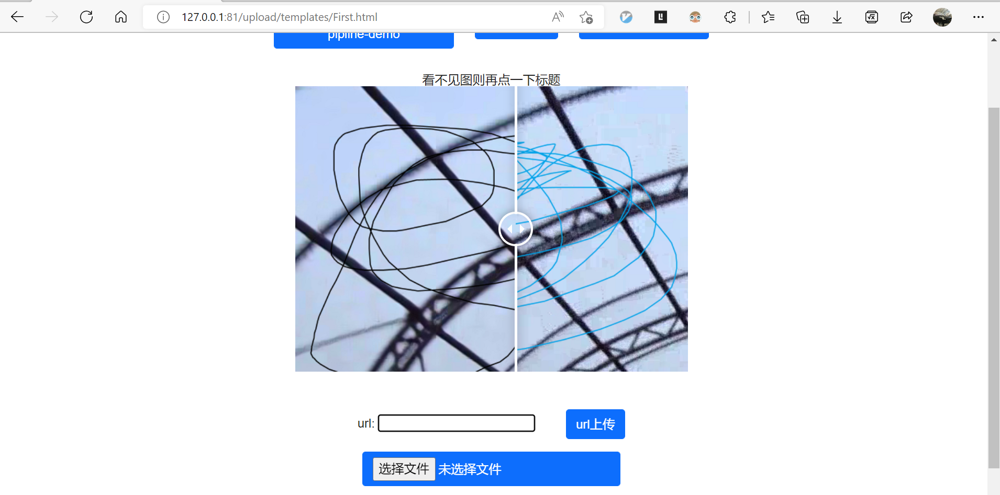
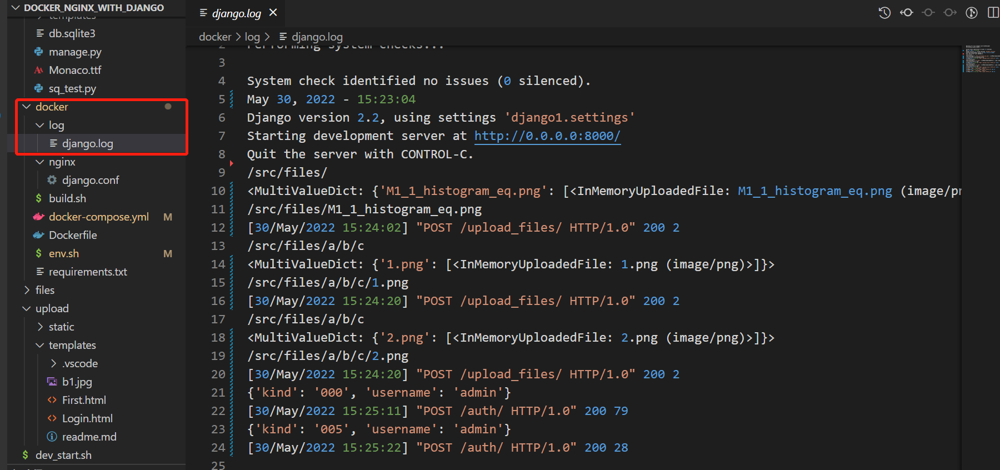
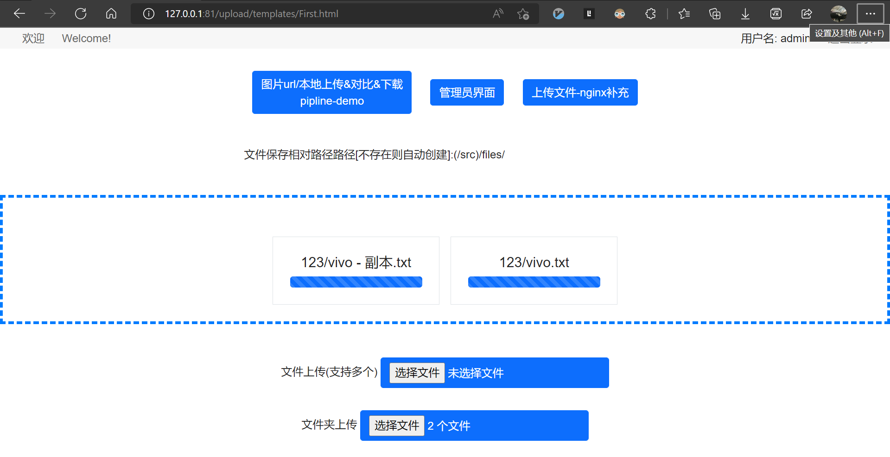

# Docker of nginx with django to support auth, upload(drag or click) and pic_pipeline.
It's a simple nginx docker with a django backend as the background management module to support user auth and upload files/folder, etc. You can loggin as admin with this account.(user:admin   passwd:a). The whole system is placed by Docker(Nginx + Uwsgi + Django + Sqlite3)!

# Why use this?

If you want to start a nginx with upload by login and user control, you can use this folder as docker to start by one command.

# How to use?
```
cd docker/
# only once
docker-compose build

docker-compose up -d  #you can change the docker-compose.yml=> xxx:/src/files path and rerun this command
```
Finally open the page by http://yourip:81/files/ to check the files folder, and open http://yourip:81/index.html to login or upload/manage(automatically jump to login). ~The django log file is at `docker/log/django.log`.~ In Uwsgi version, now the log file is at `docker/log/uwsgi.log`.

# Examples
When you start this docker, then you will get this effect:
<center class="half">










</center>

## Note
If the file is too large, then will echo 413 error for nginx/django.conf: "client_max_body_size    5120m;" #you can change this value

If model file has changed, for this repo do not refresh db file, you can run this command:
```
cd django1/
python manage.py makemigrations
python manage.py migrate
```

## Cancel db to git
```
git update-index --assume-unchanged django1/db.sqlite3 # 取消以后的更新，但需要保留目前git的状态
# git update-index --no-assume-unchanged django1/db.sqlite3 #恢复
```

## Refer
[One python file to upload easy version refer(no security design)](https://github.com/Tallguy297/SimpleHTTPServerWithUpload):
see the Refer_upload.py and run as `python3 this.py --bind 0.0.0.0 port`  
If you need run django by uwsgi manually, run `uwsgi --ini django1/uwsgi.ini` and `uwsgi --reload uwsgi.pid` to restart
